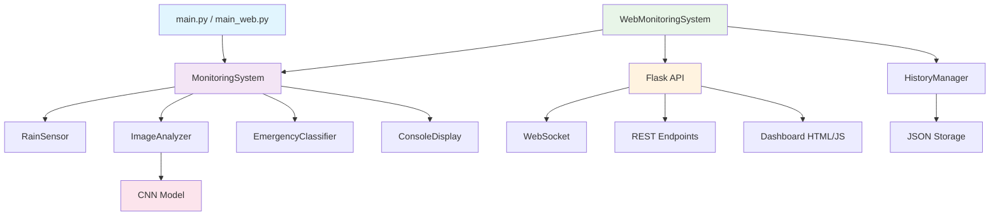
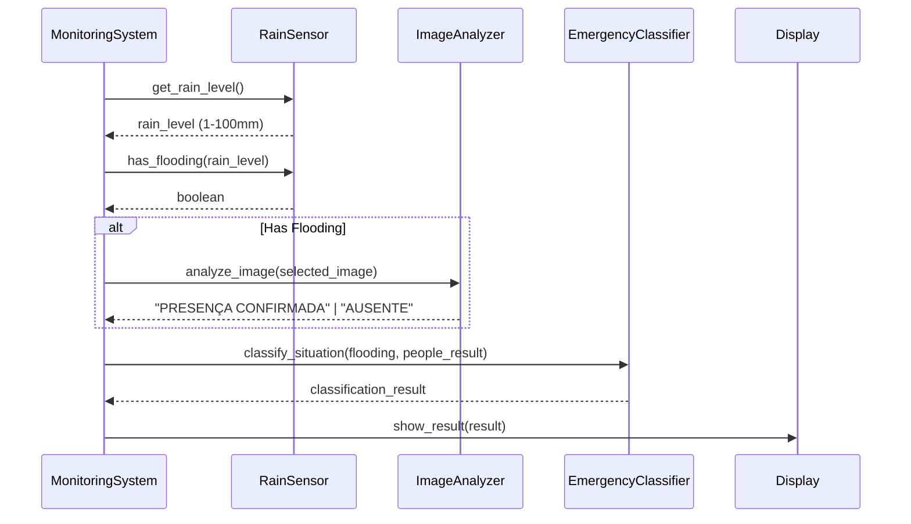
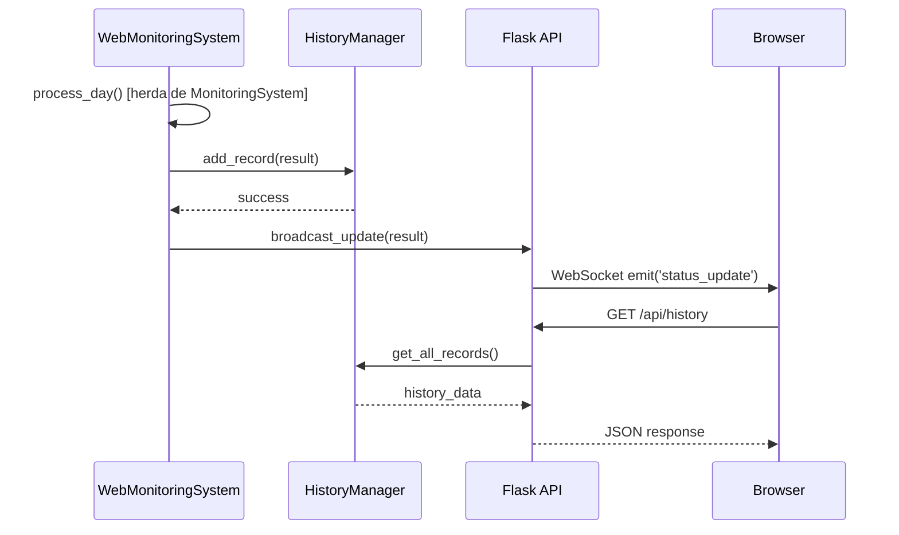

# 🏗️ Arquitetura do Sistema

## 📋 Visão Geral

O Sistema de Monitoramento de Alagamentos segue uma arquitetura modular e escalável, projetada para facilitar manutenção, testes e expansões futuras. O sistema combina processamento de IA, interface web em tempo real e persistência de dados.

## 🎯 Princípios Arquiteturais

### 1. **Separação de Responsabilidades**
- Cada módulo tem uma responsabilidade específica
- Baixo acoplamento entre componentes
- Alta coesão dentro dos módulos

### 2. **Modularidade**
- Componentes independentes e intercambiáveis
- Interfaces bem definidas entre módulos
- Facilita testes unitários e manutenção

### 3. **Escalabilidade**
- Arquitetura preparada para crescimento
- Componentes podem ser executados separadamente
- Sistema de fallback para alta disponibilidade

## 🏢 Arquitetura de Alto Nível



## 📦 Componentes Principais

### 1. **Core System (`core/`)**

#### `system.py` - Sistema Principal
```python
class MonitoringSystem:
    def __init__(self):
        self.rain_sensor = RainSensor()
        self.image_analyzer = ImageAnalyzer()
        self.classifier = EmergencyClassifier()
    
    def process_day(self):
        # Fluxo principal de processamento
```

**Responsabilidades:**
- Orquestração do fluxo principal
- Integração entre componentes
- Processamento de um ciclo completo

#### `sensor.py` - Sensor de Chuva
```python
class RainSensor:
    def get_rain_level(self) -> int:
        # Simula leitura do sensor (1-100mm)
    
    def has_flooding(self, rain_level: int) -> bool:
        # Verifica se há alagamento (≥50mm)
```

**Responsabilidades:**
- Simulação de sensor meteorológico
- Detecção de condições de alagamento
- Validação de dados de entrada

#### `image_analyzer.py` - Análise de Imagens
```python
class ImageAnalyzer:
    def __init__(self):
        self.model = self._load_model()
        self.transform = self._setup_transforms()
    
    def analyze_image(self, image_path: str) -> str:
        # Análise CNN para detecção de pessoas
```

**Responsabilidades:**
- Carregamento e gestão do modelo CNN
- Pré-processamento de imagens
- Inferência e interpretação de resultados
- Sistema de fallback com simulação

#### `classifier.py` - Classificador de Emergência
```python
class EmergencyClassifier:
    def classify_situation(self, has_flooding: bool, 
                         people_analysis_result: str) -> dict:
        # Classifica em Normal/Atenção/Perigo
```

**Responsabilidades:**
- Lógica de classificação de emergência
- Combinação de dados de múltiplas fontes
- Padronização de saídas

#### `web_system.py` - Extensão Web
```python
class WebMonitoringSystem(MonitoringSystem):
    def process_day(self):
        result = super().process_day()
        self._add_web_features(result)
        return result
```

**Responsabilidades:**
- Extensão do sistema base para web
- Integração com persistência de dados
- Notificações via WebSocket

### 2. **Modelo de IA (`models/`)**

#### `cnn_model.py` - Arquitetura CNN
```python
class CNN(nn.Module):
    def __init__(self):
        # Definição da arquitetura
        self.conv1 = nn.Conv2d(3, 32, 3, padding=1)
        self.conv2 = nn.Conv2d(32, 64, 3, padding=1)
        # ... demais camadas

def load_model(model_path: str) -> Tuple[nn.Module, dict]:
    # Carregamento seguro do modelo
```

**Responsabilidades:**
- Definição da arquitetura CNN
- Funções de carregamento de modelo
- Compatibilidade com checkpoints

### 3. **API Web (`api/`)**

#### `app.py` - Servidor Flask
```python
app = Flask(__name__)
socketio = SocketIO(app)

@app.route('/api/current-status')
def get_current_status():
    # Retorna status atual

@socketio.on('connect')
def handle_connect():
    # Gerencia conexões WebSocket
```

**Responsabilidades:**
- Servidor HTTP/WebSocket
- Endpoints REST para dados
- Servir interface web
- Broadcasting de atualizações em tempo real

### 4. **Persistência (`database/`)**

#### `storage.py` - Gerenciador de Histórico
```python
class HistoryManager:
    def add_record(self, data: dict) -> bool:
        # Adiciona registro ao histórico
    
    def get_recent_records(self, limit: int) -> List[dict]:
        # Recupera registros recentes
```

**Responsabilidades:**
- Persistência em JSON
- Gestão de histórico
- APIs de consulta de dados

### 5. **Interface (`web/` e `display/`)**

#### Templates HTML
- `dashboard.html` - Interface principal
- CSS/JS para interatividade

#### `console_display.py` - Interface Console
```python
class ConsoleDisplay:
    def show_result(self, result: dict):
        # Formatação para console
```

## 🔄 Fluxo de Dados

### 1. **Ciclo Principal de Monitoramento**



### 2. **Fluxo Web com Persistência**



## 🚀 Pontos de Entrada

### 1. **Console Mode** (`main.py`)
```python
def main():
    system = MonitoringSystem()
    display = ConsoleDisplay()
    
    while True:
        result = system.process_day()
        display.show_result(result)
        display.show_waiting()
        system.increment_day()
```

### 2. **Web Mode** (`main_web.py`)
```python
def main():
    # Thread para sistema de monitoramento
    monitoring_thread = threading.Thread(target=run_monitoring_system)
    monitoring_thread.start()
    
    # Servidor web (thread principal)
    socketio.run(app, host='0.0.0.0', port=5000)
```

### 3. **Legacy Mode** (`sistema.py`)
- Versão monolítica original
- Mantida para compatibilidade
- Não recomendada para uso

## 📊 Gestão de Estado

### 1. **Estado do Sistema**
```python
# MonitoringSystem
self.day: int              # Contador de dias
self.rain_sensor: RainSensor
self.image_analyzer: ImageAnalyzer
self.classifier: EmergencyClassifier
self.images: List[str]     # Lista de imagens disponíveis
```

### 2. **Estado do Modelo**
```python
# ImageAnalyzer
self.model: nn.Module      # Modelo CNN carregado
self.transform: transforms # Transformações de imagem
```

### 3. **Estado da Web**
```python
# WebMonitoringSystem
self.history_manager: HistoryManager
self.api_url: str
```

## 🔧 Configuração e Customização

### 1. **Arquivo de Configuração** (`config/settings.py`)
```python
# Caminhos
BASE_DIR = os.path.dirname(os.path.dirname(__file__))
MODEL_PATHS = [...]
IMAGES_PATH = os.path.join(BASE_DIR, "data/cnn/imagens")

# Parâmetros do sistema
RAIN_THRESHOLD = 50        # mm para alagamento
DISPLAY_TIME = 15          # segundos de espera
IMAGE_SIZE = 64            # resolução do modelo
SIMULATION_PRESENCE_PROB = 0.3  # probabilidade simulação
```

### 2. **Pontos de Extensão**

#### Novo Sensor
```python
class WeatherAPISensor(RainSensor):
    def get_rain_level(self):
        # Implementar integração com API real
        pass
```

#### Nova Interface
```python
class MobileDisplay(ConsoleDisplay):
    def show_result(self, result):
        # Implementar notificações mobile
        pass
```

#### Novo Modelo
```python
class ResNetModel(nn.Module):
    # Implementar arquitetura ResNet
    pass
```

## 🛡️ Tratamento de Erros

### 1. **Carregamento de Modelo**
- Múltiplos caminhos de busca
- Fallback para simulação
- Logs detalhados de erro

### 2. **Processamento de Imagens**
- Try/catch em análise CNN
- Fallback para simulação
- Validação de formato de imagem

### 3. **Persistência de Dados**
- Criação automática de diretórios
- Validação de JSON
- Recuperação em caso de corrupção

## 📈 Performance e Escalabilidade

### 1. **Otimizações Atuais**
- Carregamento único do modelo CNN
- Cache de transformações de imagem
- Processamento assíncrono na web

### 2. **Pontos de Melhoria**
- Pool de processos para análise de imagem
- Cache de resultados CNN
- Banco de dados relacional para histórico
- Balanceamento de carga para múltiplas instâncias

## 🧪 Testabilidade

### 1. **Separação de Responsabilidades**
- Cada componente pode ser testado isoladamente
- Injeção de dependência facilita mocks
- Interfaces bem definidas

### 2. **Estrutura de Testes**
```
tests/
├── test_sensor.py          # Testes do sensor
├── test_classifier.py      # Testes de classificação
├── test_image_analyzer.py  # Testes de análise CNN
└── test_system.py          # Testes de integração
```

## 🔮 Evolução Futura

### 1. **Microserviços**
- Separar análise CNN em serviço independente
- API Gateway para roteamento
- Service discovery

### 2. **Containerização**
- Docker para cada componente
- Kubernetes para orquestração
- CI/CD automatizado

### 3. **Observabilidade**
- Métricas detalhadas de performance
- Logs estruturados
- Tracing distribuído

---

Esta arquitetura foi projetada para ser robusta, escalável e de fácil manutenção, seguindo as melhores práticas de desenvolvimento de software e preparada para evolução futura.